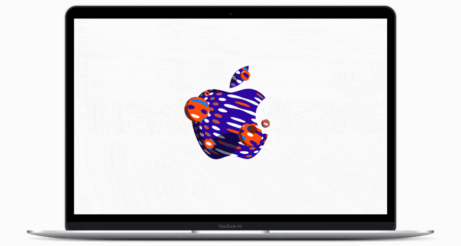

# October 30 Screen Saver

On October 30th, 2018 Apple held an [event](https://www.apple.com/apple-events/october-2018/) in New York, announcing new iPad Pros, MacBook Air and Mac mini.
For the invites to the press Apple commissioned [hundreds of interesting and creative logos](https://www.macrumors.com/2018/10/24/all-the-apple-logos/). It feels like a waste of amazing creativity to not do anything more permanent with this art. 

October 30 is a macOS screen saver (requires El Capitan or later) that randomly changes between these 371 Apple logos.

_(The GIF above is just for intro. Actually logos change smoothly and more slowly.)_

### Install
* [**Download the Screen Saver**](https://github.com/lekevicius/october30/raw/master/Release/October30.saver.zip)
* Right-click October30.saver and choose "Open" (otherwise macOS might not let you install it)
* Choose to Install just for your own user or everyone using the Mac
* Enjoy 🍎

Created by Jonas Lekevicius. Follow me on [Twitter](https://twitter.com/lekevicius).

_Not officially affiliated with Apple in any way._ Probably infringes on a bunch of copyrights. But it’s really cool stuff, so please maybe don’t DMCA C&D me. Anyways, better download this just in case, right?

